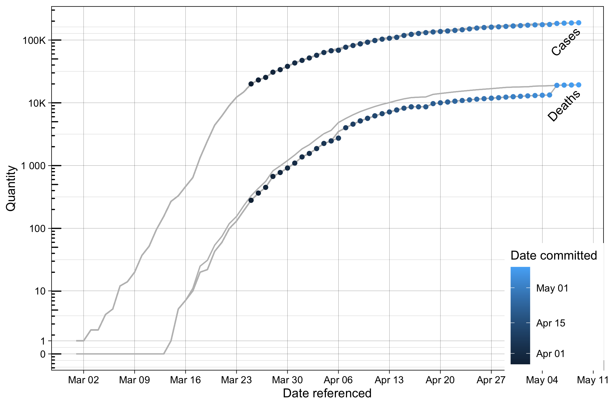

This is a collection of data and scripts for continual analysis of revisions to
public data which tracks the number of cases, deaths, and positive/negative
tests from SARS-CoV-2 in the US. It includes a `git submodule` based scheme to
keep this repository in sync with various public data sources (currently, the
NYTimes, the Covid Tracking Project, and the NYC DPH), a `makefile` to extract
from these repositories a comprehensive history of all versions of the datasets
of interest, and to clean the most current versions of this data for use with
`covidcast`, and an analysis script to analyze and visualize revisioning
present in some of these data sources. Currently, these scripts include full or
partial support for the following data sources, but others may be added:

- [nytimes/covid-19-data](https://github.com/marcusrussi/reporting-delay-data)
  NYTimes' county-level case and death data
  - ✓ reprocessing
  - ✓ analysis
  - ✓ graphs
- [COVID19Tracking/covid-tracking-data](https://github.com/COVID19Tracking/covid-tracking-data)
  The COVID Tracking Project's daily-aggregated state-level data
  - ✓ reprocessing
  - ✗ analysis (WIP)
  - ✗ graphs (WIP)
  - ✓ cleaning for `covidcast` runs
- [nychealth/coronavirus-data](https://github.com/nychealth/coronavirus-data)
  - ✓ reprocessing
  - ✓ analysis (WIP)
  - ✓ graphs (WIP)

## Usage

GNU Parallel is required. Install GNU Parallel
[here](https://www.gnu.org/software/parallel/). Then, to initialize the Git
submodules:

```bash
git clone https://github.com/marcusrussi/reporting-delay-data && cd reporting-delay-data
git submodule init
git submodule update
make -B data # Generates the history files into data-products/
```

Running `make data` will generate, into `data-products/`, the history of
NYTimes' [county-level confirmed-cases
data](https://github.com/nytimes/covid-19-data), the history of the Covid
Tracking Project's [state-level
data](https://github.com/covid19Tracking/covid-tracking-data), and the history
of the NYC Health Department's
[case-hosp-death](https://github.com/nychealth/coronavirus-data/blob/master/case-hosp-death.csv)
data.

An accompanying R script, `R/revision_analysis.R` provides utilities to analyze
and vizualize the history of this data. Currently, it is configued for
analyzing the NYTimes data, but future modifications will be made to support a
broader array of data sources.

Note that the column added by the history-processing script, `date_committed`,
is a UNIX timestamp, not a regular date.  In R, UNIX timestamps can be easily
parsed by using the `anytime` package.

## Staying current

In order to regenerate files in `data-products` as source data changes, invoke
`make` as follows, every day or so:

```bash
make -B data
```

## Example

```r
source("R/sketch.R")

plot_discrepancy(incidence, state_="New York") # Plot of cases&deaths for NYS
plot_deltas(deltas_prevalence) # Plot of revisioning actions for entire US
```

# Data cleaning

This repository is also used to clean data used for running `covidcast` on all
US states daily. Right now, the only data source used for these runs is the
Covid Tracking Project. However, test-positivity data from the Covid Tracking
Project is subject to the same errata and inconsistencies as the municipalities
they source the data frame, and so we apply a modified version of a moving
average to their test-positivity data in order to produce input to the model
that makes sense. The details of this can be found in `R/cleanCTP.R`.

In order to replicate Covid Tracking Project data that was used for a
`covidcast` run, run the following commands:

```bash
git checkout [hash] # The hash of the commit referenced in the covidcast report
make -B data
```

You will find, in data-products, the file `covidtracking-smoothed.csv`, which
is the exact input used for the run.
